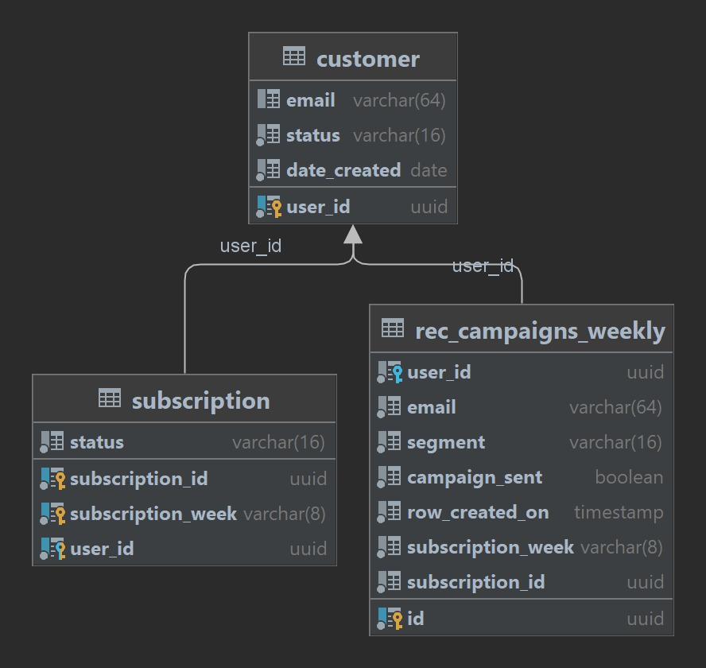
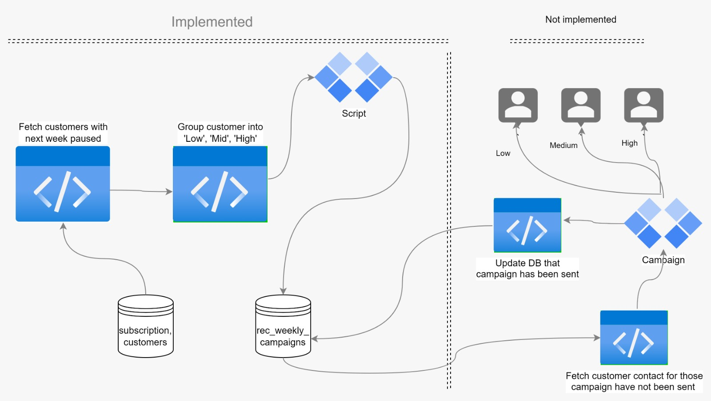
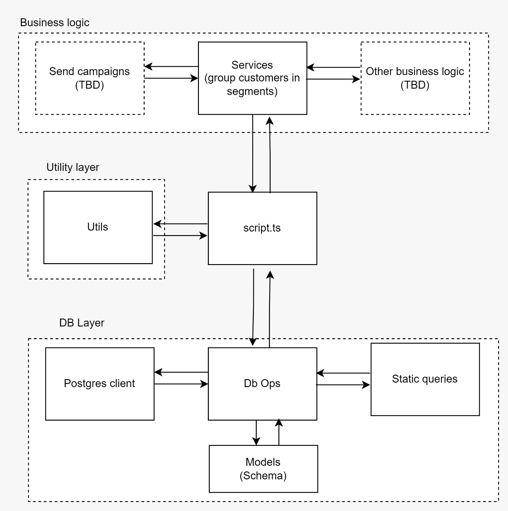

# hfscripts

The repository is a working example of executing a weekly script that enables the company to send weekly campaigns for customers, based on particular segments

## Feature

**Goal**  
Empower customers to optimize the value derived from their HelloFresh subscription.

**Objective**  
_Encourage customers who have temporarily paused their subscription to resume HelloFresh services and reap the associated benefits._

Here is a high-level overview what the feature needs to achieve:

The feature consists of three main parts:

1. First is identifying our target customers. In our case, these are the customers who 'paused' their next week's subscription

2. Once we have the target base, we need to group the customers based on the impact on business. Categorically, these are 'Low', 'Medium' and 'High' segments; where the title suggests the impact of the paused subscription

3. Upon grouping, we then need to send weekly campaign emails to customers. The content would depend upon the segment the user falls under.

## Design system for the implementation

### Database Schema



### Architecture

Here is a high-level architecture diagram that represents the implementation of the feature



### Code Structure

**NOTE**  
A - The text `TBD` represent the place where code might reside, when using the same repo for sending campaigns  
B - The code contains the schema of the table `rec_campaigns_weekly`. Since the remaining tables were created outside of the code and are being used only for reading data, their schema is not written inside the code. The schema for the other all tables is presented in the schema diagram above
<br>



### Implementation

> The logic for identifying segmented users and storing the results in the database, is fully operational. Please take a look at the code for a detailed insight into the implementation <br>

### Implementation features

**Cloud-first**  
The local PostgreSQL is setup in a free-tier cloud Postgres server. With no additional cost and increased availability, this helps in reducing the load on my local and have the database up and running as needed

**Import high data volumes**  
I have leveraged the `COPY` function of postgres, to handle the large volume of data. This is also the official recommendation from the PostgreSQL documentation.

_Pros of streaming via COPY_  
We transmit the data to the target table using an input stream. The advantage of employing this method is that, in the event of an error, the rows that were streamed up to the point of encountering the error will be successfully uploaded.

_Cons_  
A drawback of this method is the absence of fault tolerance. In the event of an error, the remaining stream would come to a halt

**Time-efficient**  
The maximum time complexity of any function is `O(n)`. This is beneficial, especially when we need to group the users into 'Low', 'Mid', and 'High' segments

> **Assumption**<br>
> While writing the code, I am assuming that no action needs to be taken for non-targeted users. Thus, I did not include customers whose immediate next week subscription is active, as mentioned in the problem statement.

## How to run the code

### Step 1: Clone the repo

```
git clone git@github.com:briwoto/hfscripts.git
```

### Step 2: Install the dependencies

**Install Yarn**

```
npm install --global yarn
```

**Install project dependencies**

```
yarn install
```

### Step 3: Setup environment variables

Create a `.env` file at the root directory. Copy the content from `.env.example` file and then replace the values of the variables with the correct values

### Step 4: Run the script

Build the script once using `yarn build`, to ensure there are no typescript complie errors. Then run:

```
yarn start
```

## CI pipeline

The CI pipeline is setup as a cronjob in Github actions. The job will run on 9am GMT every saturday. We can modify this as per business needs

<br>

## Future considerations

Because of lack of time, I could not implement the following that I had initially planned:

1. Use Kafka messaing queues instead of streaming data to the database.
2. Use serverless cloud solutions like 'Google Cloud Functions' and cloud scheduler instead of cron jobs. Cloud shcedulers are more reliable and provide 99.99% up-time, ensuring our campaigns are never delaye
